

  <h1>Jazan Uni SUC Manager (JUSM)</h1>
  
  
<b>A smart, ultra-fast, and highly interactive web application designed to help Jazan University students build, manage, and share their academic schedules with zero conflicts and maximum days off.</b>

  
<b>Whatever your major or college is, this tool will seamlessly work for you! (مهما كان تخصصك، الأداة ستعمل معك بكفاءة)</b>

  <!-- Badges -->
  

    
    
    
    
  

  <i>Developed by: Abdulaziz Mashnawi</i>

> **DISCLAIMER & TERMS OF USE:** This platform is a strictly independent, student-developed utility and is **NOT affiliated with, endorsed by, or connected to Jazan University or its official academic systems in any capacity.** Its sole purpose is to assist in organizing and visualizing potential schedules. It does NOT serve as an official registration tool, nor does it guarantee you a seat in any course section. **Therefore, you must manually complete your course registration through the official university portal whenever registration is officially opened.**
> 
> *By clicking the "Upload File" button within the application, you explicitly acknowledge and agree to the terms stated above.*
> 
> **Official University Website (Edugate):** [https://edugate.jazanu.edu.sa/jazan/ui/home.faces](https://edugate.jazanu.edu.sa/jazan/ui/home.faces)

---

## 🖼️ Screenshots (Desktop & Mobile)

### Desktop (PC)
| Dark Mode (B) | Light Mode (W) |
|:---:|:---:|
| 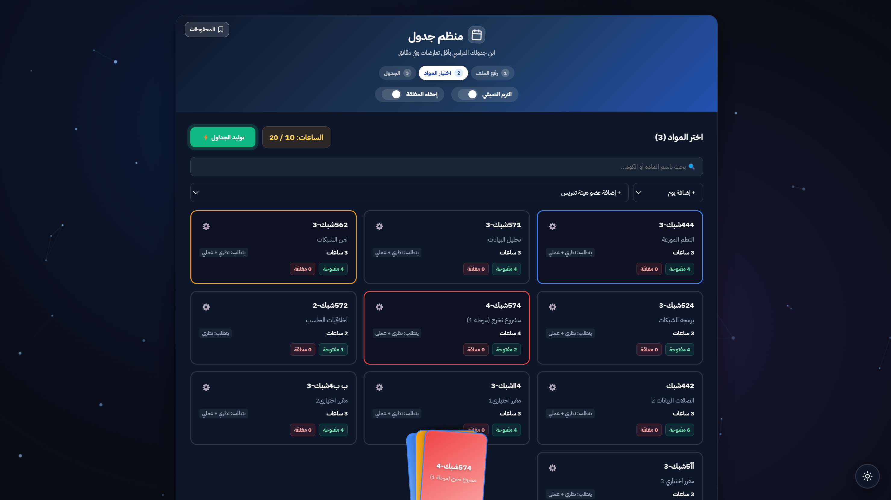 | 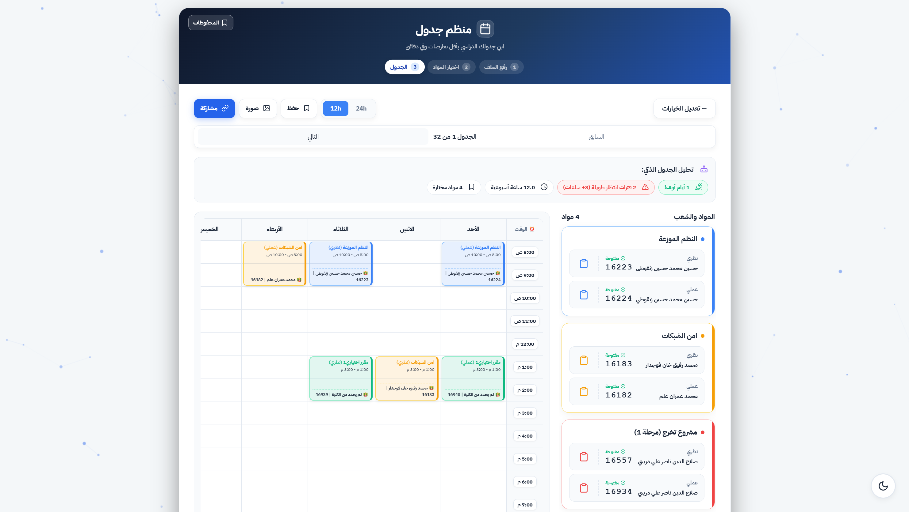 |
| 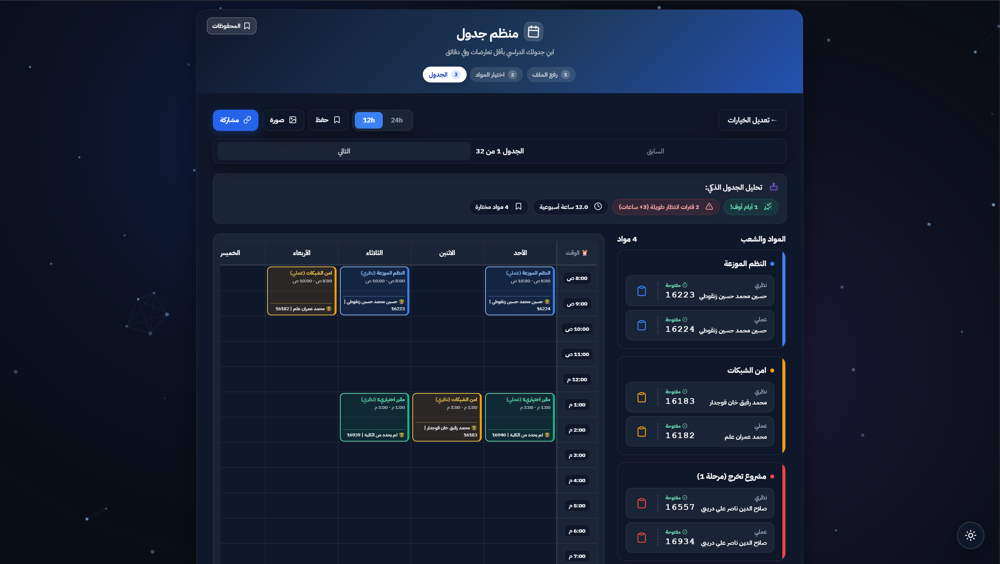 | 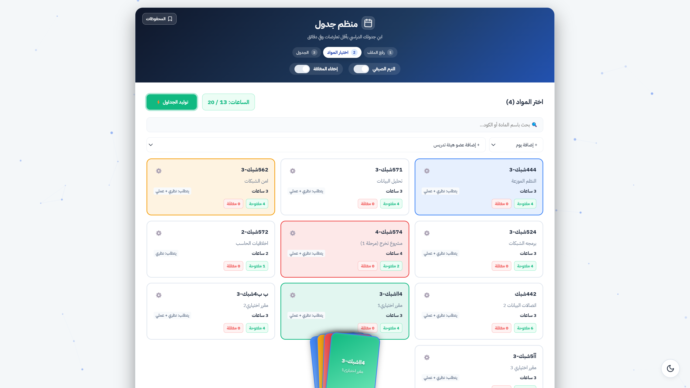 |
| 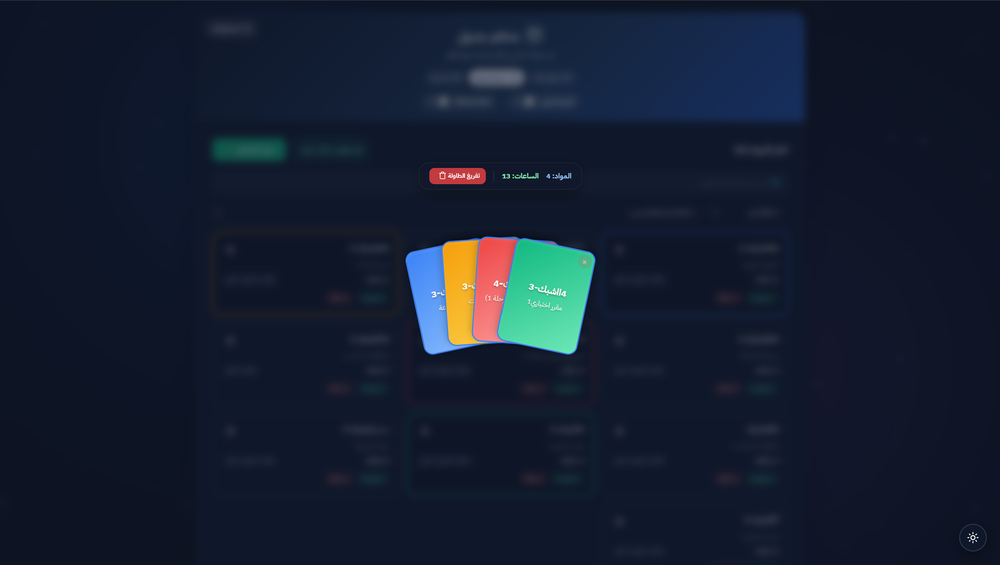 | 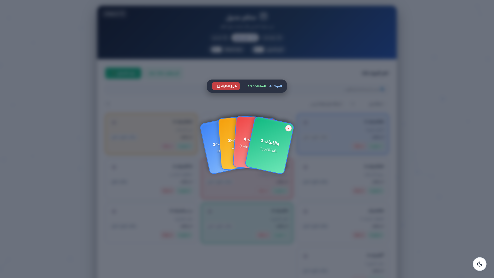 |

### Mobile (Phone)
| Dark Mode (B) | Light Mode (W) |
|:---:|:---:|
| 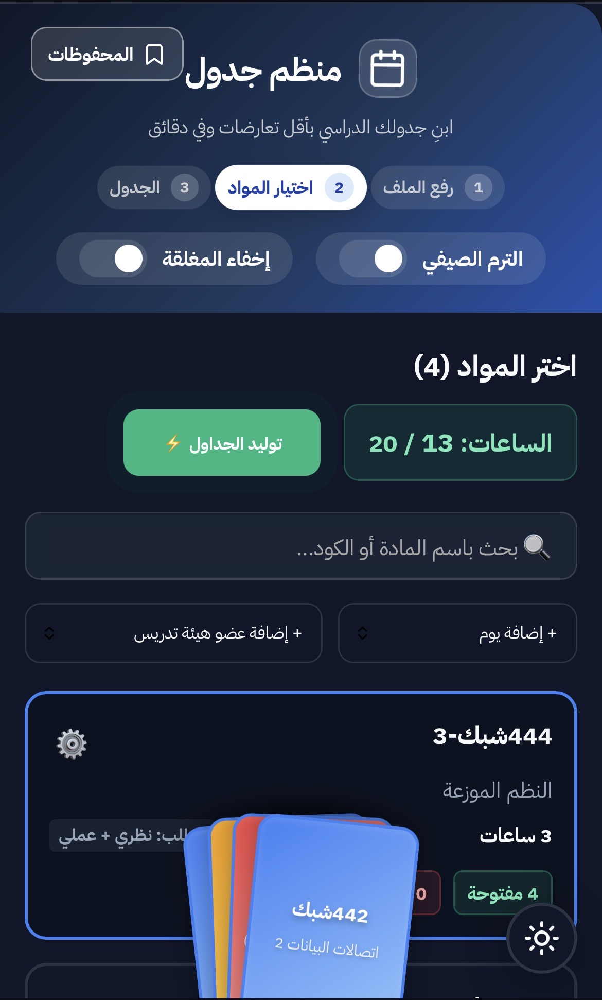 | 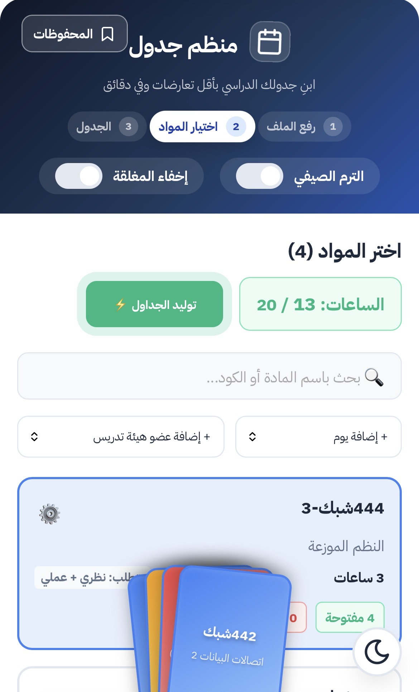 |
| 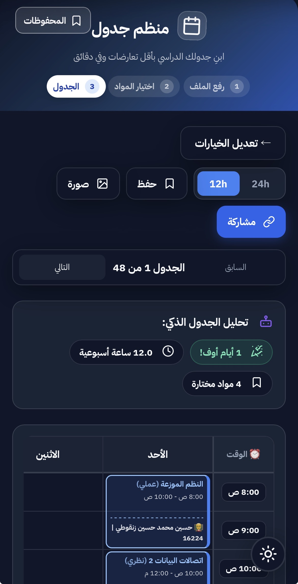 | 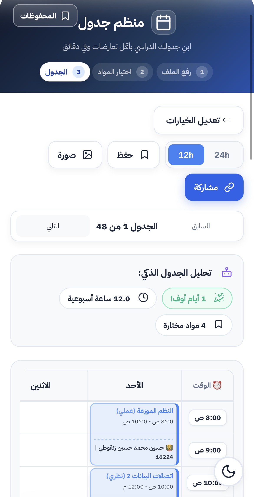 |
| 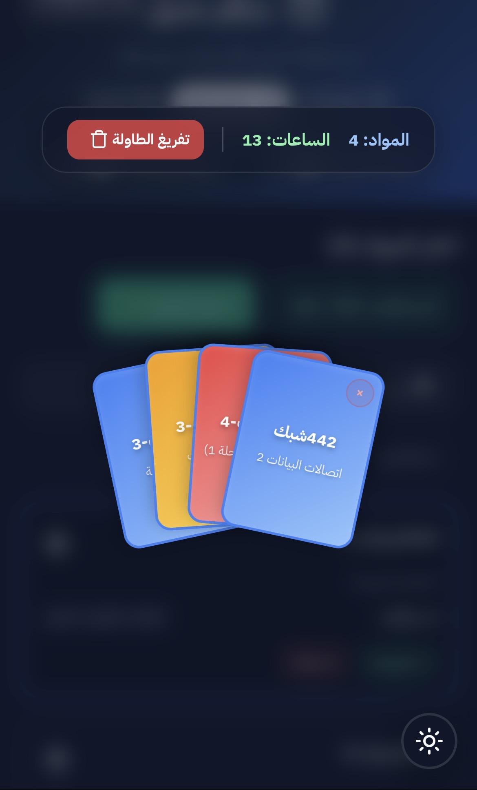 | 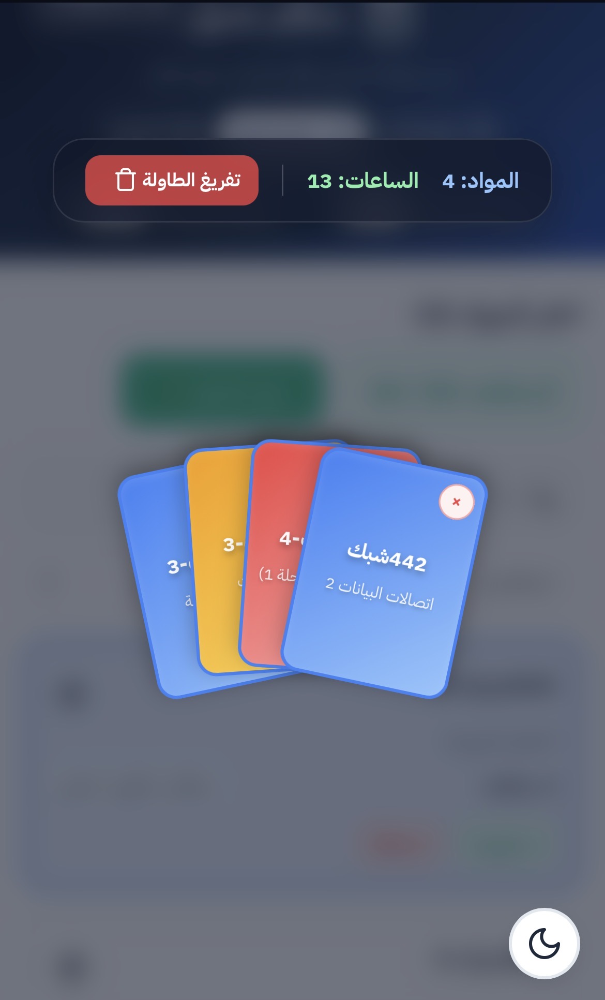 |

---

## Table of Contents
- [Key Features](#key-features)
- [The "Baloot Deck" Experience](#the-baloot-deck-experience)
- [How to Use](#how-to-use)
- [Tech Stack & Architecture](#tech-stack--architecture)
- [Privacy & Security](#privacy--security)
- [Contributing](#contributing)

---

## Key Features

* **Smart Automated Generation:** Automatically calculates and generates all possible schedule combinations, ensuring zero time conflicts.
* **Instant Edugate Parsing:** Directly parses `HTML` files saved from the "Edugate" (Academia) system to extract courses, sections, and instructors in real-time.
* **Maximum Days Off:** A smart algorithm prioritizes schedules that maximize your weekly days off, reducing daily commutes.
* **"Nuclear" Link Sharing:** Share your perfect schedule with friends instantly! We built a custom minification algorithm that compresses schedule data into extremely short, shareable URLs.
* **Dynamic Theming (Dark/Light):** Seamless Dark Mode support with gorgeous Glassmorphism UI, smooth transitions, and saved preferences.
* **High-Res Exporting:** Export your final schedule as a high-quality `PNG` image with a single click, ready to be set as your wallpaper or shared on WhatsApp.
* **Advanced Bookmarking:** Save multiple potential schedules directly to your browser's LocalStorage to compare them later.
* **Advanced Filtering:** Filter classes based on your favorite instructors and preferred days.

---

## The "Baloot Deck" Experience (Gamified UI)

We turned the boring task of selecting courses into an interactive, gamified experience inspired by playing cards:

- **3D Card Flips:** Click on any selected course card to watch it flip 180 degrees in 3D, revealing advanced instructor settings.
- **Red Alert Conflict Glow:** If two courses you select clash in timing, their cards will immediately pulse with a red warning glow.
- **Cinematic Deck Clearing:** Clicking "Clear Deck" triggers a 3-stage animation where cards gather, shake violently, and scatter explosively across your screen!
- **Glassmorphism Stats Bar:** Hovering over your deck reveals a beautiful frosted-glass stats bar tracking your total credits.

---

## How to Use

<b>Click here for step-by-step instructions</b>

1. Log in to the University's Academic System (Edugate / Academia).
2. Navigate to the **"Offered Courses"** (المقررات المطروحة) page.
3. Save the page to your device as `HTML Only` (Press `Ctrl + S` or `Cmd + S`).
4. Open the **JUSM (Jazan Uni SUC Manager)** app.
5. Upload the HTML file you just saved.
6. Browse courses, click to add them to your "Baloot Deck", and click **"Generate Schedule"**.
7. Review the conflict-free options, save your favorite, and export it as an image!

> **Pro Tip:** Use the (Instructors Settings) by clicking on any card in your deck to narrow down choices and get a schedule taught exclusively by your favorite professors.

---

## Tech Stack & Architecture

This project is built as a highly performant, dependency-light Single Page Application (SPA):

* **React 18**: For robust UI state management and complex interactions.
* **Vanilla CSS3**: We skipped heavy libraries (like Tailwind or Bootstrap) in favor of pure, highly optimized CSS featuring CSS Variables, Grid/Flexbox, 3D Transforms, and custom Keyframe animations.
* **HTML5 DOMParser**: Used for client-side parsing of Jazan University's Edugate HTML files.
* **html2canvas**: A lightweight utility to convert HTML DOM elements into exportable images.
* **Canvas Confetti**: For a touch of celebration when you successfully lock in your schedule.

---

## Privacy & Security

**Your data is 100% secure and never leaves your device.**
The application operates on an **Offline-First** and **Client-Side Rendering** architecture. All HTML file processing, conflict calculations, and schedule generation happen entirely within your local browser. **There are no backend servers**, meaning your academic data is completely private.

---

## Contributing

Have ideas to make schedule planning even less stressful? Encountered a bug? Feel free to open an `Issue` or submit a `Pull Request`. All contributions are welcome!

 

  
Made with passion for the students of Jazan University.

